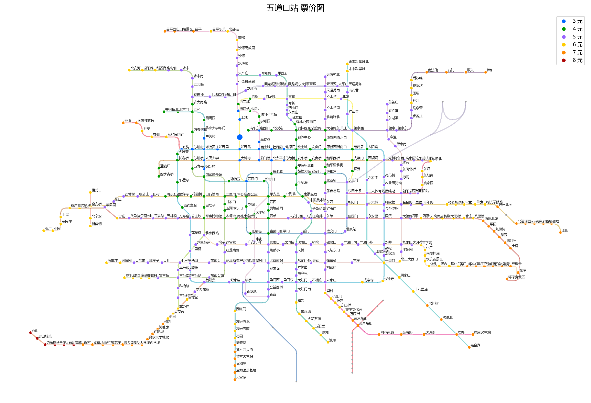
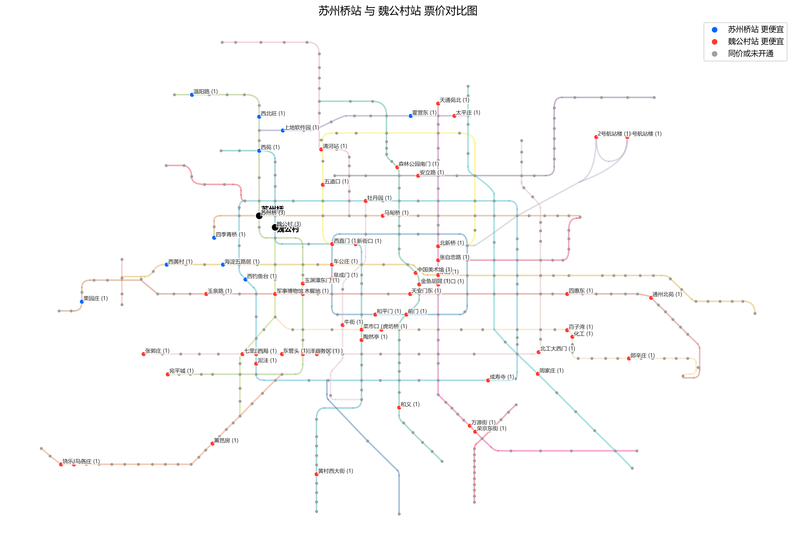

# 北京地铁票价地图工具

本项目用于生成两类票价图：

1. 单站票价图：从某个站出发，标出 3/4/5/6/7/8 元票价可到达站点。
    

2. 两站差价图：比较两个起点站到全网各站的票价，标出从哪一站上车/到哪一站下车更便宜。
    

## todo
- [ ] 文字标签重叠

## 代码结构

- 入口：`generate_fare_maps.py`，统一命令入口、缓存控制、调用爬虫与绘图。
- 数据抓取：`crawl.py`，从北京地铁接口抓取某起点到全网票价。
- 差价计算：`compare_origin_fares.py`，比较两份票价数据，输出差价与更便宜起点结果。
- 票价图绘制：`plot_fare_map.py`，读取票价 CSV + 地铁线路图 XML，绘制 3-8 元分布图。并导出标签。
- 差价图绘制：`plot_fare_diff_map.py`，基于两份票价 CSV 直接绘制差价对比图。

## 参数说明

- `--station`：单站模式起点站
- `--multiple`：批量单站模式，后接多个车站名
- `--diff STATION1 STATION2`：差价模式，比较两个起点站
- `--no-crawl`：禁止爬虫，仅使用已有缓存文件
- `--force-crawl`：忽略旧缓存，强制重爬并覆盖（线网更新时使用）

模式参数 `--station` / `--multiple` / `--diff` 互斥且必须指定一个。
爬虫参数 `--no-crawl` 与 `--force-crawl`不能同时使用。两个参数都不指定时，默认使用缓存，未检测到则爬取。

## 用法

安装依赖
```bash
pip install requests matplotlib
```

生成单站票价图
```bash
python generate_fare_maps.py --station 北京南站
```

批量生成多个单站图
```bash
python generate_fare_maps.py --multiple 五道口 西土城 人民大学
```

比较两个站票价

```bash
python generate_fare_maps.py --diff 苏州桥 魏公村
```

## 图例

### 单站票价图颜色

- 蓝：3 元
- 绿：4 元
- 紫：5 元
- 黄：6 元
- 橙：7 元
- 红：8 元
- 灰：大于 8 元或未开通

### 差价对比图颜色

- 蓝：从车站1出发更便宜
- 红：从车站2出发更便宜
- 灰：同价或未开通

标签中的 (N) 表示便宜 N 元。

